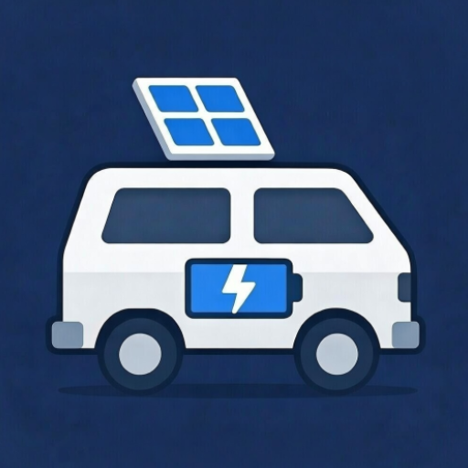
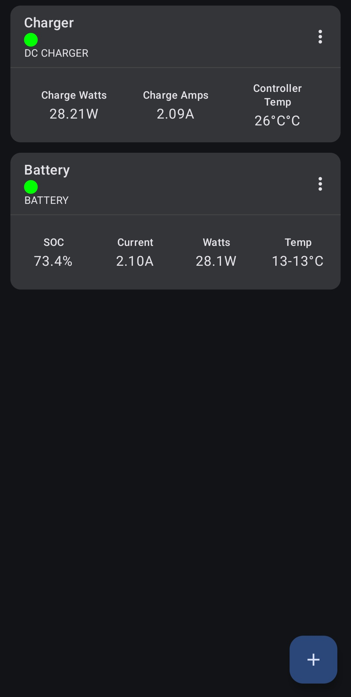
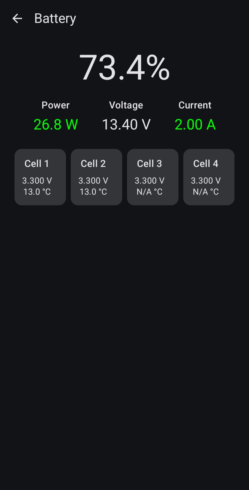
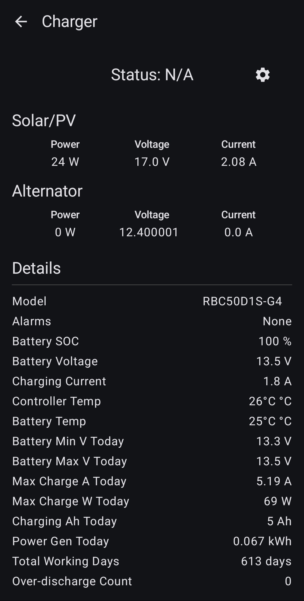

# Solar Bluetooth Android

Android app to connect to various bluetooth solar and battery devices. No internet connection or account needed.
This is originally intended to replace the Renogy DC Home app.

  
  
  

**CAUTION:** I wrote barely any of this code, it's almost entirely AI (mostly Gemini CLI).
It was a side project to **a)** replace the Renogy app and **b)** see what gemini cli was like at full vibe coding.
That being said, it has succeeded in replacing and being better than the Renogy app for me.

Currently only supports:
- Bluetooth Battery (basic data reads)
- DC Charger (basic data reads, settings writes)

It would be great to see this grow into many other products, not just Renogy and maybe even an iOS version.
So contributions are welcome.

### Acks:
- https://github.com/chadj/renogy-smart-battery
- https://github.com/cyrils/web-bt1-monitor

### Misc
- [MODBUS PROTOCAL DATA FOR DC DC battery charger with MPPT.xlsx](misc/MODBUS%20PROTOCAL%20DATA%20FOR%20DC%20DC%20battery%20charger%20with%20MPPT.xlsx) found on a T6 forum [here](https://www.t6forum.com/threads/renogy-dcc50s-display.18572/post-492147)
